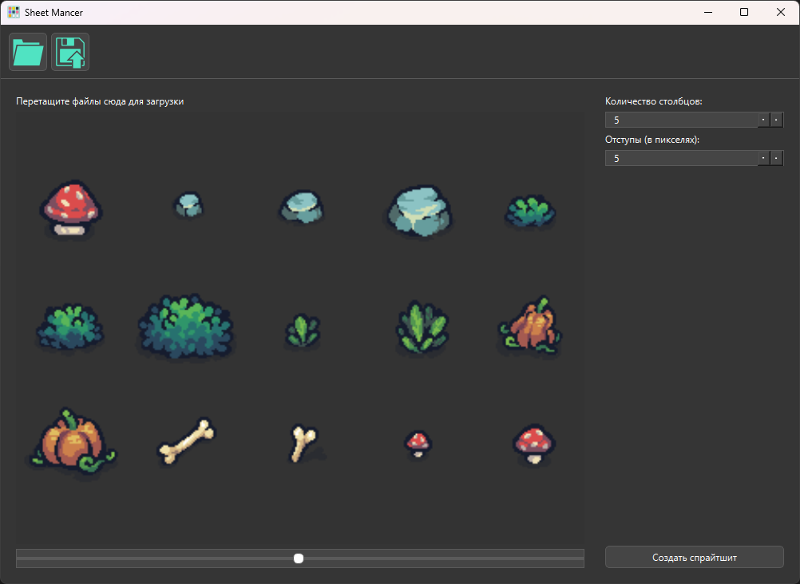

# SheetMancer

**SheetMancer** — это простой и удобный инструмент для создания спрайтшитов из набора изображений. Программа поддерживает как загрузку файлов через диалоговое окно, так и перетаскивание изображений на панель предпросмотра, после чего автоматически генерирует спрайтшит.



## Основные функции
- **Генерация спрайтшитов**: Легко объединяет изображения в один спрайтшит с настройками для количества столбцов и отступов.
- **Перетаскивание файлов**: Поддержка drag-and-drop для удобной загрузки изображений.
- **Предпросмотр**: Возможность визуально оценить спрайтшит перед сохранением.
- **Сохранение настроек**: Автоматически сохраняет последнюю открытую и сохранённую папку.

---

## Установка

1. Убедитесь, что у вас установлен Python 3.7 или выше.
2. Клонируйте репозиторий:
   ```bash
   git clone https://github.com/skvipers/SheetMancer
   cd SheetMancer
2. Установите необходимые зависимости:
   ```bash
   pip install -r requirements.txt
   ```

## Запуск
Запустите приложение с помощью следующей команды:
```bash
   python src/__main__.py
```


## Использование
1. **Добавление изображений:** Перетащите изображения в окно предпросмотра или нажмите кнопку «Загрузить спрайты» на панели инструментов.
2. **Настройка спрайтшита:** В панели настроек выберите количество столбцов и отступы между изображениями.
3. **Создание спрайтшита:** Нажмите кнопку «Создать спрайтшит» или дождитесь автоматической генерации при добавлении изображений.
4. **Сохранение спрайтшита:** Нажмите кнопку «Сохранить спрайтшит», чтобы сохранить результат в формате PNG.

## Конфигурация
   Программа автоматически сохраняет путь к последним использованным папкам в файле config.json:

- **last_open_dir:** путь к последней открытой папке для загрузки изображений.
- **last_save_dir:** путь к последней папке, в которую сохранялся спрайтшит.

## Технические детали
- **Язык:** Python 3
- **GUI-фреймворк:** PySide6 (Qt for Python)
- **Пакет для обработки изображений:** PIL (Pillow)

## Требования
- **Python 3.7** или выше
- **PySide6**
- **Pillow**

## Разработка
Если хотите внести свой вклад, просто форкните репозиторий и создайте pull request. Приветствуются идеи для улучшения, новые функции и исправление ошибок.

## Лицензия
Этот проект лицензируется под лицензией MIT. Подробности см. в файле LICENSE.
